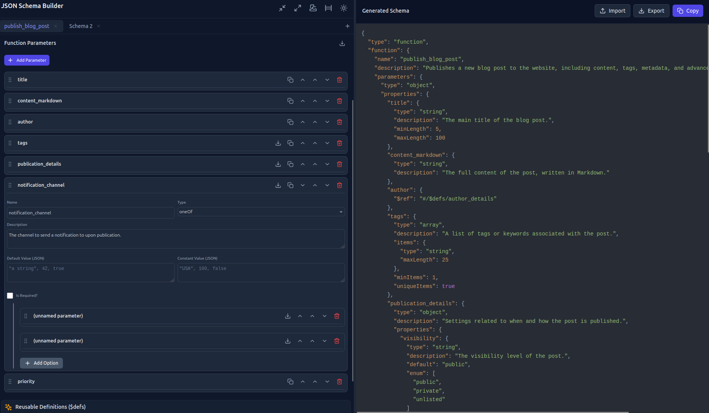

# ✨ JSON Schema Builder ✨

A professional GUI for developers to visually build, manage, and validate complex JSON Schemas. Accelerate your workflow and eliminate syntax errors, whether you're crafting API validations or defining tools for Large Language Models.

### [🚀 View the Live Demo Here!](https://anusarati.github.io/json-schema-builder/)

---


_Visually constructing a complex function calling schema for an LLM using the Dense UI mode._

## Why Use a GUI?

Writing JSON Schemas by hand is a slow, error-prone process. Even in a modern IDE with AI assistance, you're still just manipulating text. It's easy to get lost in nested brackets, miss a comma, or forget a specific validation keyword.

This JSON Schema Builder is a **power tool** that solves these problems by providing:

*   **A Visual & Structural Overview:** Stop scrolling through endless lines of JSON. The GUI provides a clear, hierarchical view of your schema's structure. Collapse what you don't need, expand what you're working on, and never lose your place.
*   **Accelerated Workflow:** Drastically reduce the time it takes to create complex schemas. The guided interface is simply faster than typing boilerplate by hand.
*   **Error-Free Syntax:** The builder generates 100% valid syntax in real-time. Focus on your schema's logic, not on hunting down bugs.
*   **First-Class LLM Support:** The "Function" root type is a purpose-built feature to generate schemas that are perfectly compatible with OpenAI's function calling API, making it trivial to define tools for your AI agents.

## Key Features

*   🎨 **Visual Hierarchy:** A true GUI to add, edit, and reorder properties with a few clicks.
*   🧪 **UI Density Control:** Choose between Comfortable, Compact, and Dense layouts to suit your workflow.
*   🤖 **LLM Function Calling Mode:** A dedicated mode to correctly structure `name`, `description`, and `parameters` for OpenAI models.
*   🐍 **Pydantic Model I/O:** Instantly generate a Pydantic `BaseModel` from your schema for use in Python backends. You can also import a schema directly from Pydantic source code.
*   🔄 **Real-time Generation:** Your schema is updated and validated with every change.
*   📑 **Multi-Tab Interface:** Work on multiple schemas in the same session.
*   📥 **Import/Export:** Import existing JSON to kickstart your work, or export your final schema as a `.json` file.
*   📋 **Copy to Clipboard:** Instantly copy the entire schema or JSON for a specific property.
*   🏗️ **Complex Type Support:** Full support for `object`, `array`, `oneOf`, and reusable `$defs`.
*   🌙 **Light & Dark Modes:** A professional UI that's comfortable day or night.
*   💾 **Persistent State:** Your work is automatically saved in your browser's local storage.
*   📦 **Static & Portable:** Run the live version or host it yourself after a simple build process.
*   ➤ **Drag & Drop:** Easily reorder properties within an object.

## How to Use

1.  **Open the Live Demo:** Navigate to the application in your browser.
2.  **Choose a Root Type:** Select "object" for a standard JSON schema or "function" for an LLM tool definition.
3.  **Build Your Schema:**
    *   Use the controls on the left panel to add properties, define types, and fill in details like descriptions and validation rules.
    *   For nested objects or arrays, simply add a property and set its type to `object` or `array` to reveal nested controls.
4.  **View the Output:**
    *   The right panel displays the generated JSON schema, which updates instantly.
5.  **Export or Copy:**
    *   Use the buttons at the top of the right panel to `Copy` the schema to your clipboard or `Export` it as a file.

## For Developers

This project uses [Vite](https://vitejs.dev/) as a build tool to handle modern JavaScript modules and Tailwind CSS compilation. You must use the Node.js package manager (`npm`) to run the application locally.

### Running Locally

1.  **Clone the repository:**
    ```bash
    git clone https://github.com/anusarati/json-schema-builder.git
    cd json-schema-builder
    ```
2.  **Install Dependencies:**
    ```bash
    npm install
    ```
3.  **Start the Development Server:**
    This server features hot-reloading, so changes you make to the source code will be reflected in the browser instantly.
    ```bash
    npm run dev
    ```
4.  **Open the Application:**
    The command will output a local URL in your terminal, typically `http://localhost:5173`.

### Building for Production

When you are ready to deploy the application (e.g., to GitHub Pages), you can create an optimized, static build.

1.  **Run the Build Command:**
    ```bash
    npm run build
    ```
2.  **Deploy the `dist` Directory:**
    This command creates a `dist` folder containing the minified and optimized application. You can deploy the contents of this `dist` folder to any static web hosting service like GitHub Pages, Vercel, or Netlify.

## Feedback & Contributions

This is an active project! If you have feedback, ideas, or find a bug, please [open an issue](https://github.com/anusarati/json-schema-builder/issues).

Pull requests are welcome and appreciated. If you'd like to contribute, please feel free to fork the repository and submit a PR.

## License

This project is released into the public domain under [The Unlicense](LICENSE).
